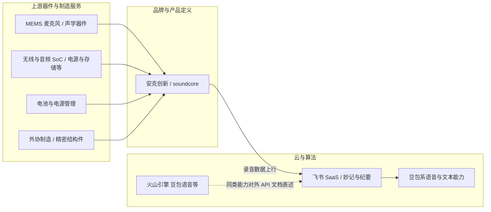

# 安克 AI 录音豆：产业链图谱与供应端调研（2026）

> **方法说明**：本文区分三类信息：**(A) 针对「安克 AI 录音豆」的公开事实**（合作分工、产品归属、算法来源等）；**(B) 安克体系/行业的可验证类比**（如声阔耳机拆解中的芯片与器件）；**(C) 基于产品规格与产业惯例的供应链推断**（标注为「推断」，非官方 BOM）。**每一处关键陈述均附参考链接**；文末为**完整参考链接清单**。

---

## 一、主导企业与职能分工

### 1.1 安克创新（硬件研发与制造侧）

- **硬件研发与制造**：飞书官方写明，产品由**安克团队负责硬件设计与制造**。[来源：飞书官网](https://www.feishu.cn/content/article/7597268954498763996)
- **销售与售后**：同一来源指出，**安克为本产品的销售与售后服务主体**。[来源：飞书官网](https://www.feishu.cn/content/article/7597268954498763996)
- **与飞书合作表述（媒体）**：第一财经称，**安克创新负责硬件端研发**；飞书侧重**软件 AI 适配与服务**、**开放接口**，使录音可接入飞书体系并沉淀为文档。[来源：第一财经](https://www.yicai.com/news/103012771.html)
- **子品牌归属（媒体）**：新浪科技转述称，该产品**归属于安克旗下子品牌 soundcore 系列**；并提及**去年 9 月**已有**海外版原型**在安克亚马逊店铺与 soundcore 独立站销售，国内飞书版为在既有硬件骨架上强化办公场景与软件工作流。[来源：新浪科技](https://finance.sina.com.cn/tech/roll/2026-01-21/doc-inhhyskr7176966.shtml)
- **安克整体经营模式（公司披露层面）**：安克创新在上市招股等文件中采用**自主研发设计 + 外协生产**等模式（具体外协厂商与采购结构以各期年报/招股书为准）。[来源：证监会披露的创业板招股说明书（申报稿）PDF](http://www.csrc.gov.cn/csrc/c101803/c1005333/1005333/files/%E5%AE%89%E5%85%8B%E5%88%9B%E6%96%B0%E7%A7%91%E6%8A%80%E8%82%A1%E4%BB%BD%E6%9C%89%E9%99%90%E5%85%AC%E5%8F%B8%E5%88%9B%E4%B8%9A%E6%9D%BF%E9%A6%96%E6%AC%A1%E5%85%AC%E5%BC%80%E5%8F%91%E8%A1%8C%E8%82%A1%E7%A5%A8%E6%8B%9B%E8%82%A1%E8%AF%B4%E6%98%8E%E4%B9%A6%EF%BC%88%E7%94%B3%E6%8A%A5%E7%A8%BF%202019%E5%B9%B49%E6%9C%8826%E6%97%A5%E6%8A%A5%E9%80%81%EF%BC%89.pdf)

### 1.2 飞书（软件、算法与生态侧）

- **软件与 AI 服务**：飞书写明由己方提供**完整的软件体系与 AI 录音、转写和纪要服务**，并与硬件一体设计以实现「录音 + 理解 + 沉淀」。[来源：飞书官网](https://www.feishu.cn/content/article/7597268954498763996)
- **语音识别与豆包**：飞书文案称，在语音识别层面采用**与豆包同源的语音大模型**。[来源：飞书官网](https://www.feishu.cn/content/article/7597268954498763996)
- **媒体报道**：第一财经记者称，安克 AI 录音豆**底层大模型技术仍由豆包提供支持**。[来源：第一财经](https://www.yicai.com/news/103012771.html)
- **开放接口与同步**：第一财经描述飞书提供**软件 AI 适配**与**开放接口**，录音可导入飞书生态。[来源：第一财经](https://www.yicai.com/news/103012771.html)
- **新浪科技归纳分工**：**安克创新负责硬件端研发与制造**；**飞书提供 AI 能力适配与软件支持，并向硬件开放接口**；采集内容可接入飞书系统，同步云端、生成纪要、拆解待办等。[来源：新浪科技](https://finance.sina.com.cn/tech/roll/2026-01-21/doc-inhhyskr7176966.shtml)

---

## 二、产业链简图（逻辑层）

> 说明：上图仅为**逻辑关系示意**；**火山引擎与飞书之间的数据路由**以实际产品与合同为准，下文引用火山引擎文档中「飞书妙记同款模型 API」的**产品表述**。

---

## 三、上游供应链：公开规格 → 可能的器件类别与「类比证据」

**重要声明**：截至本文检索时，**未发现安克或飞书公开发布「安克 AI 录音豆」完整 BOM 或单一 MEMS/SoC 型号清单**。下列为**规格反推 + 行业惯例 + 安克其他产品拆解类比**。

### 3.1 双 MEMS 麦克风阵列

| 信息类型 | 内容 | 参考链接 |
|----------|------|----------|
| 产品规格（官方） | **双高精度数字全向麦克风阵列**、约 **5 m** 收音等 | [飞书官网](https://www.feishu.cn/content/article/7597268954498763996) |
| 供应链推断 | 可穿戴拾音设备普遍采用 **MEMS 硅麦克风**；**具体品牌/料号需以拆解或采购披露为准** | （行业惯例，无单一链接；见下方类比） |
| 类比证据（非本 SKU） | 我爱音频网对 **声阔 Liberty Air 2 Pro** 拆解中可见多颗 **MEMS 硅麦**（镭雕件）用于降噪与通话 | [我爱音频网拆解](https://www.52audio.com/archives/73110.html) |

### 3.2 主控 / 蓝牙 / Wi‑Fi 与存储

| 信息类型 | 内容 | 参考链接 |
|----------|------|----------|
| 产品规格（官方/媒体） | 支持 **蓝牙与 Wi‑Fi 快传**双模式 | [飞书官网](https://www.feishu.cn/content/article/7597268954498763996) |
| 媒体评测参数 | 评测文曾列出 **8 GB** 机身存储等（属第三方描述） | [腾讯新闻](https://news.qq.com/rain/a/20260128A03FVD00) |
| 类比证据（非本 SKU） | 同一拆解显示声阔耳机**主控为恒玄 BES2300YP**，并支持蓝牙 5.0、双麦克风等（**不表示录音豆同款**） | [我爱音频网拆解](https://www.52audio.com/archives/73110.html) |
| 供应链推断 | 需同时覆盖 **BLE/Wi‑Fi** 与低功耗的 **SoC 或模组方案** + **NOR/NAND 闪存**（容量以实物为准） | 推断 |

### 3.3 电池与电源管理

| 信息类型 | 内容 | 参考链接 |
|----------|------|----------|
| 产品规格（官方） | 单体约 **8 h** 录音、配合充电仓 **32 h** 等 | [飞书官网](https://www.feishu.cn/content/article/7597268954498763996) |
| 类比证据（非本 SKU） | 声阔降噪舱充电盒软包电池标注供应商为 **VDL 重庆紫建** 等 | [我爱音频网拆解](https://www.52audio.com/archives/73110.html) |
| 类比证据（非本 SKU） | 同拆解中充电盒电源管理涉及 **思远半导体 SY8801**、无线充电 **劲芯微 CV8013N** 等 | [我爱音频网拆解](https://www.52audio.com/archives/73110.html) |

### 3.4 第三方「拆解」线索（待交叉验证）

- 行业媒体 EDN 电子技术设计等站点存在题为「拆解报告：安克 AI 录音豆」的条目（检索命中 `technews/39224`），**本站抓取不稳定**，**不宜在未阅读原文的情况下写入具体芯片型号**；若需采购级 BOM，建议以**实测拆解报告**或**安克合规渠道**为准。  
  链接占位（读者可自行打开核对）：`https://www.ednchina.com/technews/39224.html`  
- 知乎专栏存在同名拆解文章（检索命中），链接：[知乎专栏](https://zhuanlan.zhihu.com/p/2012496428900037872)（访问可能受平台限制）。

---

## 四、3–5 家关键关联企业（产业链角色简述）

以下选取 **5 家**与「安克 AI 录音豆」**在公开信息中可建立关联**或**在同类硬件产业链中高频出现**的企业；角色说明严格区分**已证实关联**与**产业典型**。

### 4.1 北京飞书科技有限公司（飞书）

- **角色**：办公协作 SaaS 平台；本产品中提供**软件、AI 转写与纪要、妙记与知识库链路**。[飞书官网](https://www.feishu.cn/content/article/7597268954498763996)

### 4.2 火山引擎（字节跳动旗下云与 AI 服务品牌）

- **角色**：对外提供 **「豆包语音」** 等产品与文档；官方文档中 **「豆包语音妙记」** 说明：提供**飞书妙记同款模型 API**，基于**语音识别大模型和豆包 LLM**，面向会议/培训/访谈等场景的转写与结构化分析。[来源：火山引擎文档](https://www.volcengine.com/docs/6561/1798349)  
- **与硬件的关联方式**：**间接**——录音豆侧语音能力在飞书文案中指向**豆包同源语音大模型** [飞书官网](https://www.feishu.cn/content/article/7597268954498763996)；火山引擎文档阐明 **妙记相关模型能力** 的对外产品形态，**不等于**证明录音豆走某一具体 API 计费项。

### 4.3 恒玄科技（Bestechnic）

- **角色**：**低功耗无线计算 SoC** 供应商，面向智能可穿戴等；官网自述产品进入**国内外知名品牌**。[来源：恒玄科技官网](https://www.bestechnic.com/)  
- **与安克体系的关联强度**：**类比**——我爱音频网对 **声阔** TWS 的拆解显示主控为 **恒玄 BES2300 系列**。[来源：我爱音频网拆解](https://www.52audio.com/archives/73110.html) **不能推出**录音豆必用恒玄芯片。

### 4.4 歌尔股份有限公司（Goertek）

- **角色**：声光电**精密零组件**、**智能整机**与高端装备；官网简介强调从**上游元器件、模组到智能硬件**的布局与垂直整合制造平台。[来源：歌尔股份官网·公司简介](https://www.goertek.com/about/intro.html)  
- **与本案关联**：**产业典型**——可为品牌客户提供声学精密制造与整机服务；**非**安克对本 SKU 供应商的公开指认。

### 4.5 瑞声科技 / AAC Technologies

- **角色**：全球**感知体验解决方案**供应商，业务涵盖**声学、MEMS 等**（官网英文首页展示集团定位）。[来源：AAC Technologies 官网](https://www.aactechnologies.com/)  
- **与本案关联**：**产业典型**——MEMS 麦克风等声学器件的重要供应方之一；**具体是否进入本 SKU**需 BOM 或拆解证实。

> **可选第 6 条（字节跳动 / 豆包）**：第一财经等媒体报道录音豆**底层大模型由豆包支持** [第一财经](https://www.yicai.com/news/103012771.html)；与火山引擎文档中的「豆包语音妙记」产品线形成**同一技术品牌的不同产品化路径** [火山引擎文档](https://www.volcengine.com/docs/6561/1798349)。

---

## 五、小结：底层商业逻辑（引用媒体归纳）

- **生态入口**：新浪科技引述行业观点，AI 硬件可获取**跨应用上下文语料**，成为 AI 理解需求的**关键入口**之一。[来源：新浪科技（转第一财经等行业信息）](https://finance.sina.com.cn/tech/roll/2026-01-21/doc-inhhyskr7176966.shtml)  
- **浅海策略与供应链复用**：同文称 AI 录音豆承接安克在**声学、功耗、结构**等既有能力，并试图在**不显著增加供应链成本**的前提下切入国内市场（媒体归纳，非安克官方财报表述）。[来源：新浪科技](https://finance.sina.com.cn/tech/roll/2026-01-21/doc-inhhyskr7176966.shtml)

---

## 六、完整参考链接清单

1. 飞书官网：《「飞书×安克创新」 AI 录音豆：不仅是形态创新，更是效率的进阶！》  
   https://www.feishu.cn/content/article/7597268954498763996  

2. 第一财经：《飞书首款AI合作硬件，联手安克创新发布了“一颗豆”》  
   https://www.yicai.com/news/103012771.html  

3. 新浪科技（亿邦动力）：《安克结盟飞书！新一代AI硬件正在“生产力平台”上寻觅增量》  
   https://finance.sina.com.cn/tech/roll/2026-01-21/doc-inhhyskr7176966.shtml  

4. 中国证监会：《安克创新科技股份有限公司创业板首次公开发行股票招股说明书（申报稿）》PDF  
   http://www.csrc.gov.cn/csrc/c101803/c1005333/1005333/files/%E5%AE%89%E5%85%8B%E5%88%9B%E6%96%B0%E7%A7%91%E6%8A%80%E8%82%A1%E4%BB%BD%E6%9C%89%E9%99%90%E5%85%AC%E5%8F%B8%E5%88%9B%E4%B8%9A%E6%9D%BF%E9%A6%96%E6%AC%A1%E5%85%AC%E5%BC%80%E5%8F%91%E8%A1%8C%E8%82%A1%E7%A5%A8%E6%8B%9B%E8%82%A1%E8%AF%B4%E6%98%8E%E4%B9%A6%EF%BC%88%E7%94%B3%E6%8A%A5%E7%A8%BF%202019%E5%B9%B49%E6%9C%8826%E6%97%A5%E6%8A%A5%E9%80%81%EF%BC%89.pdf  

5. 火山引擎文档：《产品简介——豆包语音妙记》  
   https://www.volcengine.com/docs/6561/1798349  

6. 恒玄科技官网  
   https://www.bestechnic.com/  

7. 歌尔股份官网：《公司简介》  
   https://www.goertek.com/about/intro.html  

8. AAC Technologies（瑞声科技）官网  
   https://www.aactechnologies.com/  

9. 我爱音频网：《拆解报告：Soundcore声阔降噪舱真无线耳机》  
   https://www.52audio.com/archives/73110.html  

10. 腾讯新闻：《【试毒】899元的安克x飞书AI录音豆，是怎样一种体验》  
    https://news.qq.com/rain/a/20260128A03FVD00  

11. EDN 电子技术设计（条目检索命中，正文请读者自行核对）：  
    https://www.ednchina.com/technews/39224.html  

12. 知乎专栏（拆解报告检索命中）：  
    https://zhuanlan.zhihu.com/p/2012496428900037872  

---

*文档说明：供应商与 BOM 以企业披露与权威拆解为准；本文「推断」与「类比」仅供行业研究，不构成投资或采购建议。*
